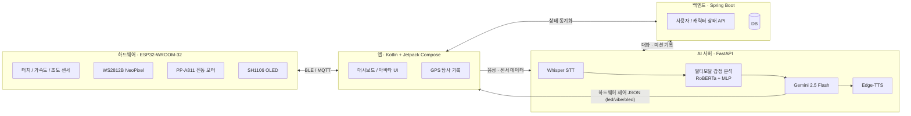

<div align="center">

# 우주탐사대원 - Orbit

### *"은둔의 궤도를 벗어나 사회라는 거대한 은하로"*

무기력한 청년들이 세상이라는 미지의 행성을 탐사하며 사회에 복귀할 수 있도록 돕는
**AI 공감형 초소형 키링 로봇 프로젝트**

[](#)
[](#팀-구성)
[](./LICENSE)

</div>

---

## 목차

- [주요 기능 및 특징](#주요-기능-및-특징)
- [캐릭터 페르소나: 오빗](#캐릭터-페르소나-오빗orbit)
- [4단계 탐사 시나리오](#4단계-탐사-시나리오)
- [예외 처리 로직](#예외-처리-로직)
- [시스템 구조](#시스템-구조)
- [폴더 구조](#폴더-구조)
- [팀 구성](#팀-구성)

---

## 주요 기능 및 특징

- **AI 공감 대화** — 사용자를 이해하고 감정을 나누는 맞춤형 대화 프로토콜
- **단계별 퀘스트** — 사용자의 상태에 맞춘 4단계 외출 유도 시나리오 수행
- **하드웨어 피드백** — OLED 디스플레이, LED, 진동 모터 등을 통한 실시간 반응
- **교감 센싱** — 터치 감지 외장을 통해 물리적인 교감 가능

## 캐릭터 페르소나: 오빗(Orbit)

| 항목 | 설명 |
| --- | --- |
| **설정** | 에너지 고갈로 사용자의 방(임시 기지)에 비상 착륙한 우주비행사 |
| **목표** | 대장(사용자)과 함께 지구 데이터를 수집하여 에너지를 충전하고 본부로 복귀하는 것 |
| **성격** | 호기심 많은 분석가이며, 대장의 작은 성공에도 우주급의 화려한 피드백을 제공함 |
| **화법** | *"치칙— 대장님, ... 오버!"* 와 같은 전문적인 우주 교신 프로토콜 사용 |

## 4단계 탐사 시나리오

| 단계 | 명칭 | 주요 내용 | 구체적 예시 |
| :---: | --- | --- | --- |
| **1단계** | 시스템 점검 | 내 안의 작은 온기 확인 | 앱 대화창에 오늘 기분을 단어로 입력하기 |
| **2단계** | 감각의 깨움 | 외부 행성 주파수 수신 | 창밖 날씨를 보고 오빗에게 음성으로 보고하기 |
| **3단계** | 행성 표면 탐사 | 방 밖 미지의 행성 착륙 | 동네 랜드마크(건물, 조형물) 사진 찍기 |
| **4단계** | 현지인과 교신 | 사회라는 은하로 복귀 | 대중교통 이용해 세 정거장 이상 이동하기 |

### 예외 처리 로직

퀘스트 거부 시 별도 멘트를 제시하고 단계를 조정하며, **3회 이상 거부 시 심리상담 서비스로 연결**됩니다.

## 시스템 구조

오빗은 하드웨어(키링) · 앱 · 백엔드 · AI 서버 네 부분이 아래와 같이 연동됩니다.



| 구성 | 주요 기술 |
| --- | --- |
| 하드웨어 | ESP32-WROOM-32, WS2812B NeoPixel, PP-A811 진동 모터, SH1106 OLED |
| 앱 | Kotlin, Jetpack Compose |
| 백엔드 | Spring Boot (사용자 · 캐릭터 상태 관리, DB) |
| AI 서버 | FastAPI, Whisper(STT), Gemini 2.5 Flash(LLM), Edge-TTS(TTS), RoBERTa+MLP 기반 멀티모달 감정 분석 |

## 폴더 구조

> 각 파트 코드가 추가될 예정인 모노레포 구조입니다.

```
Orbit/
├── app/            # 안드로이드 앱 (Kotlin, Jetpack Compose)
├── backend/        # Spring Boot 메인 서버 (사용자/캐릭터 상태, DB)
├── ai-server/      # FastAPI 기반 AI 추론 서버 (STT · 감정분석 · LLM · TTS)
├── hardware/        # ESP32 펌웨어 (Arduino / PlatformIO)
├── assets/          # 이미지 등 리소스
├── CONTRIBUTING.md
├── LICENSE
└── README.md
```

## 팀 구성

| 이름 | 역할 | 주요 브랜치 |
| --- | --- | --- |
| | Back-end | |
| | APP | |
| | HW | |
| | AI / PM | |

---

<div align="center">

기여 방법은 [CONTRIBUTING.md](./CONTRIBUTING.md)를 참고해주세요.

</div>
